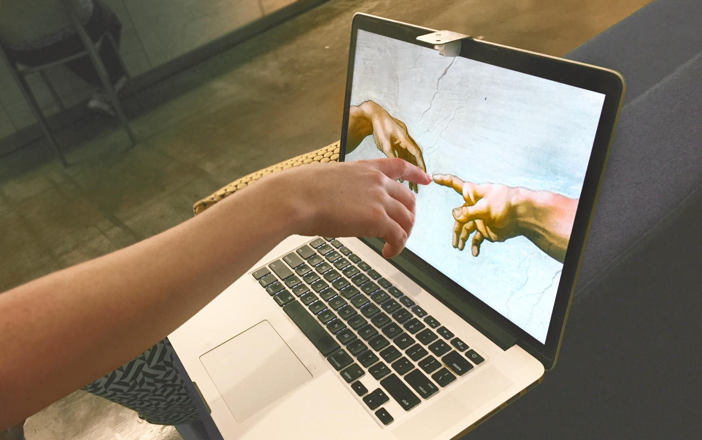

# Project Sistine

We turned a MacBook into a touchscreen using only $1 of hardware and a little bit of computer vision. The proof-of-concept, dubbed “Project Sistine” after our [recreation](https://www.anishathalye.com/media/2018/04/03/thumbnail.jpg) of the famous [painting](https://en.wikipedia.org/wiki/The_Creation_of_Adam) in the Sistine Chapel, was prototyped by [Anish Athalye](https://www.anishathalye.com/), [Kevin Kwok](https://twitter.com/antimatter15), [Guillermo Webster](https://twitter.com/biject), and [Logan Engstrom](https://github.com/lengstrom) in about 16 hours.

## Basic Principle

The basic principle behind Sistine is simple. Surfaces viewed from an angle tend to look shiny, and you can tell if a finger is touching the surface by checking if it’s touching its own reflection.

Kevin, back in middle school, noticed this phenomenon and built [ShinyTouch](https://antimatter15.com/project/shinytouch/), utilizing an external webcam to build a touch input system requiring virtually no setup. We wanted to see if we could miniaturize the idea and make it work without an external webcam. Our idea was to retrofit a small mirror in front of a MacBook’s built-in webcam, so that the webcam would be looking down at the computer screen at a sharp angle. The camera would be able to see fingers hovering over or touching the screen, and we’d be able to translate the video feed into touch events using computer vision.

(Read the rest of our blog post, including a video demo and a high-level explanation of the algorithm, [here](https://www.anishathalye.com/2018/04/03/macbook-touchscreen/))

## Installation (with Homebrew Python)

* First, make sure you have [Mac Homebrew](https://brew.sh/) installed on your computer. If not, you can install it by running `/usr/bin/ruby -e "$(curl -fsSL https://raw.githubusercontent.com/Homebrew/install/master/install)"`

* Install Python 2 via Homebrew with `brew install python2`

* Install OpenCV 3 via Homebrew with `brew install opencv3`

* Install PyObjC via Pip with `pip2 install pyobjc`

## Running

Run `python2 sistine.py`

## License

Copyright (c) 2016-2018 Anish Athalye, Kevin Kwok, Guillermo Webster, and Logan
Engstrom. Released under the MIT License. See [LICENSE.md][license] for
details.

[license]: LICENSE.md
